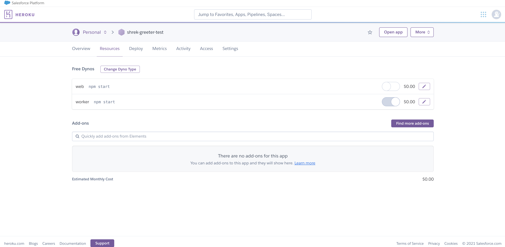

# Shrek Greeter

A Discord bot to play a special message from Shrek whenver a user joins a voice channel. Hosted as a single worker dyno on Heroku.

## Usage

### Local

Set discord bot token value in the `.env` file.

```
TOKEN=<token_value>
```

Start bot running with `make start_bot`

Alternatively:

Set `TOKEN` environment variable

```bash
export TOKEN=<token_value>
```

Start bot running with `npm start`

### Heroku

Should use Procfile to set just a worker node and run `npm start`

```
worker: npm start
```

**NOTE**: Ensure Heroku does not start a web dyno and that the worker dyno is running

## Setup

I began creating this bot by following [this guide](https://www.sitepoint.com/discord-bot-node-js/) and using my own experience to adjust the funtionality to my needs.

### Technologies

The following technologies are used to run this bot. Once you have installed each of these, continue to the next section.

- [Git](https://git-scm.com/book/en/v2/Getting-Started-Installing-Git)
- [Heroku](https://devcenter.heroku.com/articles/heroku-cli)
- [NodeJS](https://nodejs.org/en/download/)

### Accounts

In addition to using those technologies, you will need a [Discord](https://discord.com/) account, a [GitHub](https://github.com/) account, and a [Heroku](https://www.heroku.com/home) account.

We will actually be running our bot code from the Heroku account. Under the free tier, Heroku offers 550 free dyno hours (server hours) per month, after which it will make your dyno sleep. This means it can have your bot up and running 24/7 for about 22 days at which point your bot will sleep and not function. However, if you validate a credit card on your account, Heroku will give you an additional 450 free hours for a total of 1000 free hours per month. This amount is enough to keep our bot up and running for the whole month.

### Discord Bot Setup

Once you have the Discord and Heroku accounts, login to your discord application in the browser and navigate to the [Discord Developer Portal](https://discord.com/developers). Once there, click **New Application**. Give your application a name and click the **Create** button.


Once your application has been created, go to the bot page by selecting **Bot** in the navigation menu. Click the **Add Bot** button and confirm your decision by clicking **Yes, do it!**.


Once your bot user has been created, ensure **Requires OAuth2 Code Grant** is not selected. Next, click the **Copy** button under token to copy the token used by your application to login to your discord server. Store this token in a secure location as we will be using it later.


Next, navigate to the **OAuth2** page from the navigation menu. Under the **OAuth2 URL Generator**, select the **bot** scope and the **View Channels**, **Connect**, and **Speak** permissions.


Copy the url generated in the bottom of the **Scopes** section and open it in another browser page. This will bring up a page asking for you to select a server. **Manage Server** permissions are required to add a bot.


If this is successful you should see that your bot user was added to your server.


### Running the Bot

If you have not already, download the code in the repo by opening a terminal and running:

```sh
git clone https://github.com/mreed19/ShrekGreeter.git
cd ShrekGreeter
```

Install the required dependencies to run the bot by running:

```sh
npm install
```

Create a file in the `ShrekGreeter` directory and name it `.env`. In this file, add the line `TOKEN=` followed by the bot token that we copied and saved earlier. The file should look like:

```
TOKEN=mytesttokenvalues1234
```

Finally, we can start our bot running with the command

```sh
make start_bot
```

You should see a message that your bot has logged in!


To test it out, join a voice channel and wait a few seconds. You should be greeted by a lovely message from Shrek!

To stop the bot from running, focus the terminal that is logged in as our bot and use the `ctrl+c` keys.

### Deploying to Heroku

So now that we know how to run our bot, how do we keep it going 24/7 without having to maintain the running application on our computer? To accomplish this we can make use of heroku.

To setup our bot on heroku, login to your account and click **Create new app**. Choose an available name for your app and create it.


Once the heroku application has been created, navigate to **Settings** and click **Reveal Config Vars**. Add a value using the **KEY** of **TOKEN** and the **VALUE** of the bot token that we copied and saved earlier (should be in your `.env` file if you don't still have it copied). Make sure to click **Add** to save this value for your application.


Now that our heroku application is configured, go back to the terminal we ran our application in and login to heroku using the following command:

```sh
heroku login
```

After you have logged in successfully, configure git to push the code to your heroku application by running the following, substituting `<app_name>` with the name of the heroku application:

```sh
heroku git:remote -a <app_name>
```

Finally, push the code to heroku with:

```sh
git push heroku master
```

This should cause heroku to trigger a build of our application and start it running. To check that is was successful, return to your discord server and join a voice channel. You should once again be greeted by a lovely message from Shrek.

There is one final thing to check to ensure that our application stays up and running. By default, heroku will try to run a web dyno for node applications. These are designed to sleep after 30 minutes of inactivity to save resources. Since we want our bot always ready, we have our application configured to run the bot as a worker dyno. To make sure that heroku runs this the way that we want, go to the **Resources** tab of the heroku application to view **Free Dynos**. Edit the web and worker dynos to be set so the web dyno is off but the worker dyno is on.



And that's all there is to it! Happy Botting!
